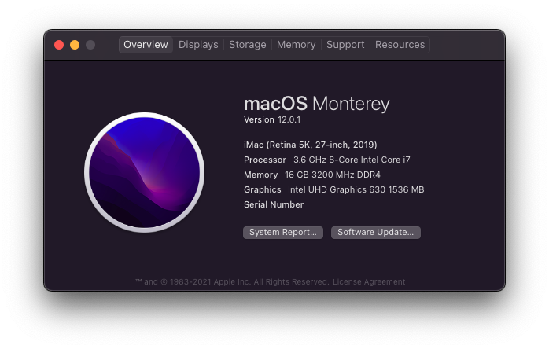
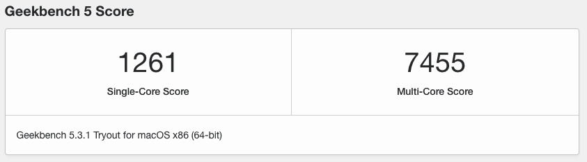

# Hackintosh (OpenCore, Z390 Aorus Pro WiFi)

> Personal OpenCore configuration for Gigabyte Z390 Aorus Pro WiFi, Intel Core i7-9700K and Intel UHD Graphics 630 (iGPU)

## Disclaimer

This is my personal configuration and I made it publicly available for educational and inspirational purposes only. Please learn how to configure and install OpenCore using the [OpenCore Install Guide](https://dortania.github.io/OpenCore-Install-Guide/).

I'm not responsible for any damage nor will I give support.

**Note:** Don't use or trust any OpenCore files (drivers, kexts, etc.) that are not from the official sources. Always gather/compile them yourself.

## Software

- OpenCore: 0.6.5
- macOS: 11.2.3 (Big Sur)

## Hardware

- Motherboard: Gigabyte Z390 Aorus Pro WiFi
  - Note: WiFi/Bluetooth is handled by an external card (see below).
- CPU: Intel Core i7-9700K
- iGPU: Intel UHD Graphics 630
- GPU: ASUS ROG Strix GeForce GTX 1070 Ti Advanced OC _(Disabled)_
- RAM: Corsair 16GB DDR4 Vengeance LPX 3200 MHz
- SSD:
  - WD_BLACK SN750 NVMe 1TB, M.2
  - Crucial MX500 500GB, M.2
  - Crucial BX100 250GB, 2.5"
  - Crucial M500 120GB, 2.5"
- WiFi/Bluetooth: Fenvi T919

### Peripherals

- Mouse: Logitech G Pro X Superlight
- Keyboard: KBC Poker 3
- Headset: Kingston HyperX Cloud
- Speakers: Audioengine A2+
- Monitor: Acer Nitro XF252Q (1080p)

## Features

Only essential features are listed below and may be incomplete, but updated/fixed if necessary.

### Working

- Hardware Acceleration
- Onboard/Front/HDMI Audio
- Ethernet
- USB 2.0/3.0/3.1
- iServices
  - FaceTime
  - iMessage
- Airdrop
- Bluetooth
- WiFi

## `config.plist`

Values that are `{{REPLACE_ME}}` must be replaced with actual values.

### Quirks

#### `DeviceProperties/Add/PciRoot(0x0)/Pci(0x2,0x0)`

- With macOS 10.15.5 the recommended value `07009B3E` for `AAPL,ig-platform-id` isn't working (anymore) for Intel UHD 630 and will result it a black screen.
  - Fix: Use the alternative value `00009B3E`.
- Using only the suggested keys from the [OpenCore Coffee Lake Guide](https://dortania.github.io/OpenCore-Install-Guide/config.plist/coffee-lake.html#deviceproperties) `AAPL,ig-platform-id`, `framebuffer-patch-enable` and `framebuffer-stolenmem` aren't sufficient and will result in a black screen after the OpenCore boot sequence.
  - Fix: [iGPU BusID Patching](https://dortania.github.io/OpenCore-Desktop-Guide/extras/gpu-patches.html#igpu-busid-patching) is necessary. After several reboots, it's port 3 and busID `04` to get a video signal (Note: `AAPL,ig-platform-id` must be set to a working value beforehand).

## Benchmark

### Geekbench

## Bookmarks

- [BIOS Settings](https://dortania.github.io/OpenCore-Install-Guide/config.plist/coffee-lake.html#intel-bios-settings)
- [Generate `PlatformInfo` values](https://dortania.github.io/OpenCore-Install-Guide/config.plist/coffee-lake.html#platforminfo)
- [OpenCore Sanity Checker](https://opencore.slowgeek.com/)
